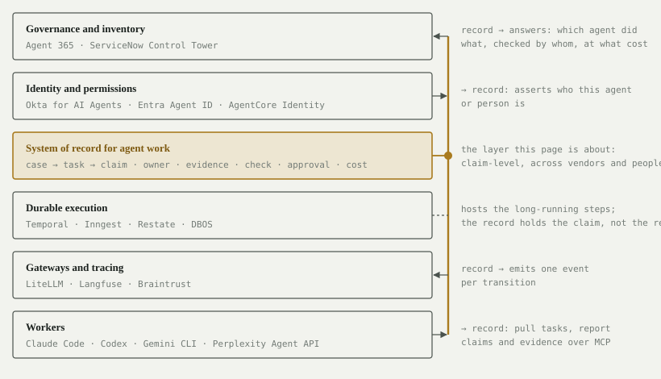
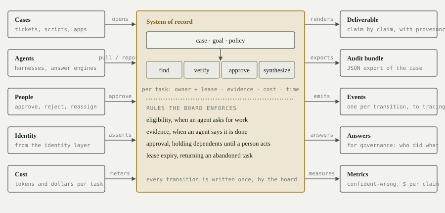
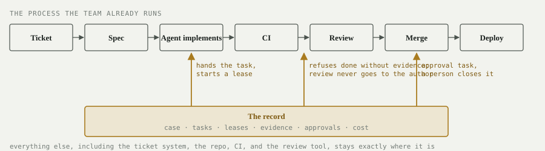
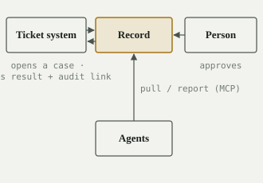
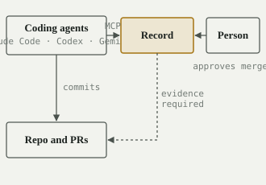
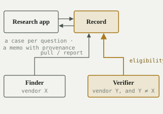
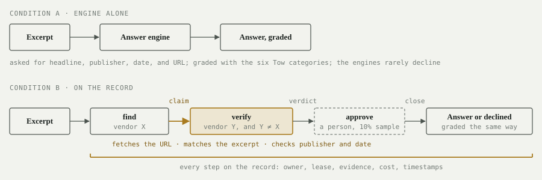

<!-- Design note. Published with figures at https://claude.ai/code/artifact/2eed6f40-f3e2-47b0-8e23-8627a80c332f . Source of truth for the system-of-record work tracked in the feat/system-of-record issue. -->

# Marcus as a System of Record

*Where the record of agent work sits, what flows through it, how teams wire it in, what has to change in Marcus, and the first experiment that proves it.*

## The argument in one paragraph

Every team that runs AI agents on real work ends up hand-building the same thing: a durable, vendor-neutral record of who did what, what evidence came back, who checked it, what a person approved, and what it cost.
Nothing in the 2026 stack sells that record.
Tracing tools record calls, durable-execution engines record workflow state, governance tools inventory agents, and each vendor logs its own answers; none of them holds a claim-level, accountable record across vendors and people.
Marcus already is most of that record at the code level, because its board is the only channel agents have, so every transition is already written down.
Turning Marcus into the system of record takes three kinds of work.
First, make the board enforce three rules it currently leaves to the agent's honor: a task cannot be marked done without the proof its kind requires; a task is offered only to an agent allowed to take it, so a claim is never checked by its own author or its author's vendor; and some tasks can be completed only by a person, with everything downstream waiting for them.
Second, let a task be something other than "write code on a branch": find a source, verify a claim, approve a result, assemble the deliverable.
Third, keep the software machinery (worktrees, branch merging, the spec decomposer, the web-app smoke test) but make it a module the record does not depend on.
The first proof is a replication of the Tow Center's citation study: the same excerpts, the same engines, with and without an independent verifier on the board, scored with the same categories, with every step on the record.

## Definitions

A **case** is one unit of work with a goal and a policy: "identify the source of this excerpt," "produce the literature map for this proposal," "settle this claim." A **task** is one step inside a case, and it has a **kind**: find (produce a claim with sources), verify (check a claim you did not make), approve (a person accepts or rejects), synthesize (assemble the deliverable from accepted claims), or implement (the software-shaped kind Marcus has today).
A **claim** is what a find task produces: an assertion plus the sources behind it. **Evidence** is the typed payload a task must return to close; the board rejects a "done" without it. **Eligibility** is the rule the board applies before offering a task to an agent; for a verify task, the rule is "not the author of the claim, and not the author's vendor." An **approval** is a task only a human principal can complete; tasks that depend on it wait.
The **audit bundle** is the export of a case: every task, who took it and when, the lease history, the evidence, the approvals, and the cost.
The **system of record** is the store that holds all of this and enforces the rules, independent of which vendor's agents did the work.

## Where it sits

The 2026 production agent stack is bought in layers, and each layer records something.
The record layer is distinct because of *what* it records (claims and accountability, not calls or workflow state) and *for whom* (every vendor's agents and the people around them, not one vendor's product).



Read the figure bottom-up.
Workers do the work; they are harnesses (Claude Code, Codex, Gemini CLI) or answer engines (Perplexity's Agent API), and they reach the record over MCP, which Marcus already speaks.
Gateways and tracing record calls, tokens, and spans; the record emits one event per transition into them and does not compete with them.
Durable execution keeps a long workflow alive across crashes; it hosts the long steps, but it has no notion of a claim, a verifier, or an approval.
Identity asserts who an agent or person is; the record consumes that assertion rather than owning it.
Governance and inventory tools need to answer "which agent did what, checked by whom, at what cost," and today they cannot, because nothing beneath them holds that; the record is what they would read.
Scott's walled-garden point lands here: a lab can log its own agents, and Perplexity's enterprise audit log does exactly that, but a vendor cannot be the neutral record of work done by other vendors' agents and by people.

## What flows in, what comes out



The figure is the general shape.
Here is one case, end to end, with the values the record would actually hold.
The excerpt is a sentence from the Tow Center report itself, so every fact in the example is checkable.

**The case is opened.** The Tow runner script creates case `tow-0137` with a goal and a policy.
Goal: identify the headline, publisher, publication date, and URL of the excerpt "Collectively, they provided incorrect answers to more than 60 percent of queries." Policy: the claim must be verified by an agent from a different vendor than the finder; ten percent of cases get a human approval, and this one is in the sample; a claim that cannot be verified closes as declined.
The board writes four tasks: a find task, a verify task that depends on it, an approve task that depends on that, and a synthesize task that depends on the approval.

**A finder takes the find task.** Agent `finder-pplx-1`, registered with vendor `perplexity` and principal `agent`, calls request_next_task at 14:02:11.
The board offers the find task (any finder is eligible), starts a lease, and records the assignment.
The agent sends the excerpt to Perplexity's Agent API and at 14:02:19 calls report_task_progress with status completed and this evidence:

```text
headline:  "AI Search Has a Citation Problem"
publisher: "Columbia Journalism Review"
date:      "2025-03-06"
url:       "https://www.cjr.org/tow_center/we-compared-eight-ai-search-engines-theyre-all-bad-at-citing-news.php"
raw:       (the engine's full response, kept verbatim)
```

The evidence matches the find task's output schema, so the board closes the task, releases the lease, files the cost row for that call (illustrative: 1,850 tokens, $0.004), and copies the validated evidence minus `raw` into the inputs of the verify task that depends on it.
That copy is the only route by which a claim reaches a verifier.
Had the agent reported "completed" with no evidence, the board would have refused and told it which fields were missing.

**The board refuses two agents and accepts a third.** The verify task is now available. `finder-pplx-1` asks for its next task; the board does not offer it, because it authored the claim. `verifier-pplx-2` asks; the board does not offer it either, because its vendor is the author's vendor. `verifier-gem-1`, vendor `google`, asks at 14:03:02 and is offered the task.
It sees the claim and the URL, and nothing else: not the finder's reasoning, not the raw response, because the context tool on a verify task returns the task's inputs and never the dependency's raw evidence.
It fetches the URL (the site permits crawlers), finds the excerpt verbatim on the page, confirms the domain matches the publisher and the page date matches, and at 14:03:40 reports:

```text
verdict:  verified
checks:   excerpt_found=true  domain_match=true  date_match=true
fetched:  2026-09-12T14:03:31Z   http_status=200
```

**A person approves.** Because this case is in the sample, the approve task exists, and it is offered only to principals of kind human.
Larry, registered as `larry` with principal `human`, lists open approvals at 14:31, sees the claim, the verdict, and the fetched page snippet side by side, and approves.
Until that moment the synthesize task was held; the board never pushed anything to him, and no agent could have completed the approval in his place.

**The case closes.** The synthesize task runs and the case answer is the claim, marked verified and approved.
Six things now exist that did not exist at 14:02.

The deliverable, one row in the replication's results table: headline, publisher, date, URL, category "correct," with a provenance line: found by finder-pplx-1 (Perplexity), verified by verifier-gem-1 (Google), approved by larry.

The audit bundle, the case exported as JSON, which reads like this when trimmed:

```text
case: tow-0137   status: closed/verified   opened: 14:02:05   closed: 14:31:12
find     finder-pplx-1   perplexity   14:02:11 -> 14:02:19   evidence: {headline, publisher, date, url, raw}   cost: $0.004
verify   verifier-gem-1  google       14:03:02 -> 14:03:40   evidence: {verdict: verified, checks: 3/3}      cost: $0.006
approve  larry           human        14:31:00 -> 14:31:12   decision: approved
refused  finder-pplx-1 (author of claim)   verifier-pplx-2 (same vendor as author)
```

Events, nine of them, emitted to tracing as they happened: case opened, three assignments, three completions, one approval, case closed.

An answer for governance, available as a query: which agents touched `tow-0137`?
Two agents from two vendors and one person, with timestamps.

Metrics, also queries: this case scores correct, was not declined, cost $0.010 in model calls (illustrative), and took 29 minutes, 28 of them waiting for a person, which is the number that tells you how to size the approval sample.

**The same case when the finder is wrong.** Suppose the finder had returned a plausible but fabricated URL, the failure the Tow study found in more than half of some engines' answers.
Nothing changes until the verify step. `verifier-gem-1` fetches the URL, gets a 404, and reports `verdict: unverifiable, http_status=404`.
The policy says an unverifiable claim closes as declined, so the case closes declined, the deliverable row reads "declined: source could not be verified," and the audit bundle shows exactly which URL failed and when.
What the engine alone would have delivered as a confident, wrong citation, the record delivers as an honest decline with the reason attached.
That conversion, at that step, is the whole product.

In general form: five things flow in (a case from whatever owns the work, agents pulling and reporting over MCP, people approving, identity assertions, cost per task), the board enforces four rules at the moments they matter (eligibility when an agent asks, evidence when it says it is done, approval as a gate, lease expiry as recovery), and five things flow out (the deliverable, the audit bundle, events, answers for governance, and metrics), all of them queries over what the board already holds.

## Where Marcus fits when it is not the whole process

The Tow example made Marcus the entire process, because an experiment needs a closed loop it controls.
Real work is not like that.
The process already exists, with people, tools, and stakes, and nobody is going to replace it with a board.
So the honest question is where the record gets interjected into a process that is already running, and the answer is: at exactly three moments, and nowhere else.
When work is handed to an agent.
When an agent says it is done.
When a person has to sign off.
Everything between those moments stays where it is today.

Before the examples, the question underneath them: how does knowing a claim is wrong help?
Three ways.
First, the wrongness is caught before it reaches the person who would act on it, and the harm of an agent's error is almost never the error itself; it is the downstream action taken on it: the citation repeated in a brief, the code merged, the claim paid.
Second, it is caught where the fix is cheap (re-run the step, or decline) and by a party that cannot be talked into agreement by the author's confidence, because the checker never sees the author's reasoning, only the claim.
Third, because every catch is recorded, you learn your error rate per vendor per task type, which is the one number that tells you where people must stay in the loop and where they can leave it.
Without a record you never know your error rate; you know your incident rate, which is the error rate minus everything nobody noticed.
The Tow study is the public version of a measurement most teams have never made on their own work.



**An engineering team shipping with coding agents.** This is the shape of the workflow your engineers run today, and the shape your AI Coding Best Practices course teaches: a ticket, a spec, a coding agent implementing on a branch, CI, a review, a merge.
Take an illustrative ticket, `BRT-4821: add unit conversion to the export`.
Nothing about the ticket system, the repo, CI, or the review tool changes.
Three things do.

When the engineer marks the ticket ready, the record opens a case and writes an implement task with the spec's acceptance checks attached as the task contract.
A Claude Code session pulls it, exactly as Marcus sessions pull today, and starts a lease.
GitHub, CI, and the branch are untouched; the only difference is that the assignment exists somewhere other than in the agent's own chat.

When the agent says it is done, the record refuses to close the task without evidence: the test command it ran and the output, which is Marcus's smoke gate made mandatory instead of optional.
Then a review task opens, and the board will not offer it to the session that wrote the code, or to another session from the same vendor.
A Codex session takes it, sees the spec and the diff and nothing else, runs the three acceptance checks from the spec, finds that one of them fails (the export still writes kilograms when the locale is imperial), and reports `verdict: contradicted, checks 2/3, failing: acceptance-3`.
The implement task reopens with that verdict attached; the same Claude Code session, or another, picks it back up.
This is the layered code review from your course, with the independence enforced by the board instead of asked for by a guideline.
The reviewer cannot be the author, and the reviewer cannot be persuaded, because it never hears the author's argument.

When the checks pass, the merge is an approval task that only the human reviewer can complete.
She sees the diff, the two verification reports, and the cost so far, and approves.
The record posts one comment on the pull request: the audit link.
GitHub merges.
Nothing else about her tooling changed.

What the team has afterward that it did not have before: no self-certified "done" anywhere in the pipeline; every merged change arrives with an independent check attached and a person's name on the approval; a per-ticket cost and rework count (this ticket: two implement passes, one review, $0.41 in model calls, illustrative); and, after a quarter, the number that matters for staffing: how often the independent check catches something the author's own tests did not.
That number is the argument for keeping the reviewer step, or for dropping it on low-risk tickets, and today no team has it.

**An operations desk with money on the line.** The same three moments appear wherever an agent proposes a decision a person is accountable for.
Take the shape of a warranty-claims desk at an equipment manufacturer: a dealer submits a claim, a classifier reads the claim against the rulebook and proposes approve or reject with the rule it relied on, an adjuster reviews, the claims system records the decision, and payment follows.
The claims system stays the system of record for the claim.
The record described here is the system of record for the agent's work on the claim, which the claims system does not hold.

The interjection is the same.
When the classifier's proposal comes back, it is evidence on a find task: the decision, the cited rule, the claim fields it matched.
A verify task goes to a different model with one narrow job: open the cited rule and confirm it says what the classifier claims, and confirm the claim's fields meet the rule's conditions.
Above a dollar threshold, or whenever the two disagree, an approve task holds the decision for the adjuster; below it, with agreement, the decision flows straight through and the record still shows both agents' work.
The case's audit bundle is attached back to the claim in the claims system.
When an auditor asks eight months later why claim 88213 was paid, the answer is a bundle with the rule, the check, and the adjuster's name, not a chat transcript.
When the classifier's error rate on rule 14.2 turns out to be four times its rate elsewhere, the threshold for that rule moves, on evidence.

**Which example is for whom.** The Tow replication is the academic proof: it isolates the mechanism, it is comparable to a published baseline, and it is what a paper, the STTR, or a skeptical engineer like Scott would want to see.
The engineering workflow is the demo for your own people and the likeliest first paying use, because the tools are already in place and the pain (an agent's "done" that nobody independently checked) is felt weekly.
The operations desk is the case Scott was pointing at: real data, real stakes, and a person whose name goes on the decision.

## How teams engineer it into their workflows

Three integration patterns cover most cases.
In every one, the record does not run the agents; it is the board they pull from and report to.







**Sidecar to an existing workflow.** The team keeps its ticketing or case-management system.
A webhook opens a case in the record when a ticket reaches a state ("needs research," "ready for verification").
Agents, already running wherever they run, point their MCP configuration at the record and pull.
When the case closes, the record posts the result and a link to the audit bundle back to the ticket.
Nothing about the team's tooling changes except that the agent work now has a record.

**The harness's board.** For engineering teams, the record is the shared board that Claude Code, Codex, and Gemini CLI sessions pull from, which is exactly how Marcus runs today: an `.mcp.json` entry pointing at the record's HTTP endpoint, a CLAUDE.md or AGENTS.md that says "request your next task, report with evidence, request again." The difference from today is that merges become approval tasks a person completes on the board, and a completion without evidence is refused.

**Engine behind a vertical application.** A research or diligence product creates one case per question.
A finder task goes to one vendor's engine, a verify task goes to a different vendor's model under the eligibility rule, an approve task goes to the analyst, and a synthesize task renders the memo with claim-level provenance.
The application never talks to the agents; it talks to the record.

The wiring for an agent is the same in all three, and it is the wiring Marcus already has: register, then loop.

```text
register_agent(agent_id="finder-pplx-1", name="Perplexity finder",
               role="finder", skills=["find"], vendor="perplexity",
               principal="agent")

loop:
  task = request_next_task(agent_id)          # board applies eligibility
  ...do the work...
  report_task_progress(agent_id, task.id, status="completed",
                       evidence={...typed payload for task.kind...})
                                              # board refuses without evidence
```

A person is a principal of kind `human` registered the same way; the only task kind offered to them is approve.

## What has to change in Marcus

The change is smaller than the size of the repository suggests, because the record is the part of Marcus that already works.
Each row names where the behavior lives on `develop` at `a4236573`.

| Component | Today, in the code | Change | Status |
|---|---|---|---|
| The board | `SQLiteKanban` in `src/integrations/providers/sqlite_kanban.py`; `Task` in `src/core/models.py` with `dependencies`, `labels`, `acceptance_criteria`, `output_paths` | Keep. Add `kind`, `inputs`, and `output_schema` to `Task`; add a column in the SQLite provider | Keep |
| Pull and report over MCP | `request_next_task` (`src/marcus_mcp/tools/task.py:2180`), `report_task_progress` (`:4057`), tool surface in `src/marcus_mcp/tool_groups.py` | Keep | Keep |
| Ownership and recovery | `AssignmentLeaseManager` in `src/core/assignment_lease.py`; persistence in `src/core/assignment_persistence.py`; hardening from #729 and #731 | Keep | Keep |
| Evidence | `report_task_progress` already accepts `evidence` and `verifications`; the smoke gate (`_run_product_smoke_gate`, `:1071`) enforces them only for integration tasks, and #679 made self-verification optional | Require evidence to close for find, verify, and synthesize kinds, validated against `output_schema`; leave the software gate alone | Add |
| Eligibility | `find_optimal_task_basic` (`:6545`) scores `agent.skills ∩ task.labels`; nothing prevents an author from verifying its own claim | Filter `available_tasks` by an eligibility rule before scoring, in both entry points (`_find_optimal_task_original_logic` and the coordinator's `find_optimal_task_with_subtasks`) | Add |
| Agent identity | `register_agent(agent_id, name, role, skills, state, project_id="")` in `src/marcus_mcp/tools/agent.py:16`; `WorkerStatus` has `role` and `skills` | Add `vendor` and `principal` (`agent` or `human`) so eligibility has something to check | Add |
| Approval | None; `TaskStatus` is TODO, IN_PROGRESS, DONE, BLOCKED | An `approve` kind that only a `human` principal may complete; dependents are already held by dependency resolution | Add |
| Cost | `CostStore` at `~/.marcus/costs.db` (`src/marcus_mcp/server.py:188`), ingested by worktree path shape | Keep; key rows by `agent_id` for non-git workers | Keep |
| Audit bundle | `get_usage_report` in `src/marcus_mcp/tools/audit_tools.py` covers usage only | Add an export of a case: tasks, assignments, lease history, evidence, approvals, cost | Add |
| Decomposition | `_analyze_prd_deeply`, `_generate_task_hierarchy`, `_generate_contracts_by_domain`, planner model via `ai.provider` | Optional plugin; cases can be seeded directly | Strip |
| Git runtime | worktrees, branch merging (#730), `spawn_agents.py`, `run_experiment.py`, the web-app smoke gate | Move behind an extension boundary as the software adapter | Strip |
| Providers, telemetry, memory | Planka, Linear, GitHub providers; telemetry; memory system (import missing) | Not needed for the record; leave untouched, do not load | Strip |

Two clarifications.
First, this is not marcus-mini.
Mini is the red-line research instrument: capability-blind, no evidence, no cost, no approval, because coordination does not break without them.
The record core is a different cut: it keeps evidence, cost, and approval, which are the point, and drops decomposition and git, which are the software adapter.
Second, none of the additions cross the Bright Line.
Eligibility is environment design: the board declines to offer a task, and the agent still self-selects among what is offered.
Evidence to close is the contract Marcus authors at setup time, which is Invariant #2 as clarified in v2.
An approval is a task only a person can take, which is board-mediated with nothing pushed.

## Why shared state solves this

The failure the Tow Center measured is one actor grading its own work: eight engines answered confidently, were wrong most of the time, and almost never declined.
A shared board makes four things structural that agent-to-agent conversation can only request.
Separation of duties is enforceable, because assignment is the board's decision; in a conversation the finder chooses who checks it, or checks itself.
The record is a byproduct, not an extra step: every transition is already on the board, so the audit bundle is a query.
Workers are independent: the verifier sees the claim and the URL, never the finder's reasoning, which is what makes the check adversarial instead of agreeable.
And people and failures are ordinary: an approval is a task only a person can take, and a dead agent's lease expires and the task returns.
This is the board-versus-conversation thesis Marcus was built to prove, applied to verification.

## Protocol: replicating the Tow Center study with a record

**Purpose.** Measure whether an independent verification step, enforced and recorded on a shared board, reduces confidently wrong citations relative to answer engines alone, and at what cost in money, time, and declined answers.

**Materials.** The Tow Center dataset: twenty publishers with varying crawler policies, ten articles each, a hand-selected excerpt per article, released publicly on GitHub with the March 2025 report.
Engines reachable by API: Perplexity (Agent API, cited answers in one call), OpenAI (Responses API with web search), Google (Gemini with search grounding), xAI (Grok with search).
The original study also tested ChatGPT Search, Copilot, and DeepSeek Search through their interfaces; Copilot has no comparable API, so the replication covers the API-reachable subset and says so.



**Condition A, engine alone.** For each excerpt and each engine, one request: identify the headline, publisher, publication date, and URL.
Record the raw response, the model name, and the timestamp.

**Condition B, the record.** For each excerpt, one case with three tasks.
A find task, offered to finder agents; each finder is one engine wrapped as a pull-loop worker that reports a claim as evidence: `{headline, publisher, date, url, raw_response}`.
A verify task, dependent on the find task, offered only to agents whose vendor differs from the finder's; the verifier fetches the claimed URL respecting robots.txt, checks that the excerpt appears on the page (normalized, minimum span), checks the publisher against the page's domain and the date within a one-day tolerance, and reports `{verdict: verified | contradicted | unverifiable, checks: {...}, fetched_at}`.
An approve task, dependent on the verify task, on a ten percent sample of cases, completed by a person, to calibrate the verifier.
Close: verified claims become the case's answer; contradicted claims close as declined with the contradiction recorded; unverifiable claims (blocked, moved, 404) close as declined.
Declining is the honest answer the original engines refused to give.

**Condition C, a verifier with no record.** The same verifier worker applied to Condition A's answers as a post-hoc filter, with no board: no eligibility rule, no held close, no lease, no audit bundle, just a script that runs the check and drops or keeps the answer.
C and B share one fetch cache, keyed by URL and stamped with the fetch time, so their fetch results and timing are identical and a page that moves between runs scores the same in both.
This condition exists to keep the claim honest.
The accuracy gain comes from the verifier, and a bolted-on verifier should score about the same as Condition B in a lab.
What Condition B adds is not accuracy; it is that the check cannot be skipped, cannot be done by the author or the author's vendor, cannot be lost, and can be shown to a third party.
If B and C score alike, that is the expected result, and the report says so.

**Scoring.** Apply the Tow categories to the final answer of each case: correct; correct but incomplete; partially incorrect; completely incorrect; not provided; crawler blocked.
Then compute four rates.
Confident-wrong rate: partially or completely incorrect among answers that were not declined.
Fabricated-URL rate: URLs that resolve to an error or to the wrong page.
Decline rate: not provided plus unverifiable.
Correct rate: correct plus correct but incomplete.
Score label-blind: the grader sees answers without knowing the condition.

**Hypotheses, written before running.** H1: for the same finder engine, Condition B's confident-wrong rate is below five percent, against the study's aggregate above sixty percent and Perplexity's thirty-seven.
H2: Condition B's decline rate rises, and the size of the rise is reported as the cost of honesty.
H3: cost per case in B is within three times the cost of the same query in A.
Any hypothesis the data rejects is reported as rejected.

**Expected results, written before the run.** For Condition A, a confident-wrong rate of 15 to 40 percent depending on engine, below the 2025 figures because the engines improved, with fabricated or broken URLs still reaching 5 to 30 percent of answers and declines under 5 percent.
For Condition C, a confident-wrong rate under 3 percent among kept answers and essentially no broken URLs, bought with a decline rate of 20 to 45 percent and a correct rate a few points below A, because correct answers on crawler-blocked or moved pages become declines.
For Condition B, the same accuracy as C, a slightly lower decline rate if the policy allows one re-find after a contradiction, cost of 2.5 to 4 times A, and minutes per case instead of seconds.
The largest single source of declines will be publishers that block a well-behaved fetcher; those cases close as "cannot verify," which is the honest outcome the engines refused to give.
What falsifies what: a B confident-wrong rate above 10 percent means the verifier is being fooled (syndicated copies, quoting pages) and needs to be better; a decline rate above 50 percent, net of the link-rot and crawler-block baseline measured before the pilot, means fetch-based verification is impractical for this domain, while declines caused by rot indict neither the verifier nor the record and are reported separately; a cost above 5 times A confines the record to high-stakes, low-volume work.
B and C scoring alike is the expected result, not a failure; the record's contribution is shown by the audit bundles and the refusal log, not by the score.

**Sample and cost.** The full dataset is two hundred excerpts.
Condition A across four engines is eight hundred requests.
Condition B with two finder vendors is four hundred cases, each with two model calls plus one page fetch.
Illustrative arithmetic, to be replaced by the cost store's actual figures: at roughly one cent per finder call and two cents per verifier call and fetch, four hundred cases cost about twelve dollars; at ten times that estimate, under one hundred fifty.
Before any model call, sweep the ground-truth URLs with the verifier's own fetcher and robots policy and record the share that return an error, redirect elsewhere, or block crawlers; that share is the link-rot baseline, and the decline rate is reported both raw and net of it.
Then run a fifty-excerpt pilot to shake out the verifier before spending the rest.

**Cautions.** Crawler-blocked publishers: the verifier must respect robots.txt, and "unverifiable" counts as declined, never as correct.
Drift: the dataset is eighteen months old and some pages have moved or died; the sweep above measures how many before the pilot spends anything, and moved pages count as unverifiable.
Vendor drift: record model names and dates in the audit bundle, which the record does by construction.
Grader independence: the person scoring must not be the person who wrote the verifier's rules.
Identity: vendor and principal are self-declared at registration in this pilot, so the eligibility rule is only as strong as that assertion; the report states this as a limit, and in production the identity layer below the record asserts it.

**Deliverable.** A short report that reproduces the study's tables with two rows added (each engine alone, each engine with the record), and the audit bundle for every case published alongside it, so that anyone who doubts a number can open the case and check.
That report is the demo for Scott, the first public proof of the ledger, and the STTR's preliminary result.

## Patch outline

Ordered so each step is testable on its own, with tests written first per the repository's own rules.
Line numbers refer to `develop` at `a4236573`.

**1. Task kinds and typed outputs.** In `src/core/models.py`, add to `Task`: `kind: str = "implement"`, `inputs: Dict[str, Any]`, `output_schema: Optional[Dict[str, Any]]`.
Persist them in `src/integrations/providers/sqlite_kanban.py` (new columns, default `implement`, so every existing board loads unchanged).
Tests in `tests/unit/core/`: a task round-trips through SQLite with its kind and schema.

**2. Principals and vendors.** In `src/marcus_mcp/tools/agent.py`, extend `register_agent` with `vendor: str = ""` and `principal: str = "agent"`, stored on `WorkerStatus`; extend the tool's input schema where the MCP handlers declare it.
Tests: registering a human principal and an agent principal, and rejection of an unknown principal value.

**3. Eligibility at assignment.** Add `src/marcus_mcp/coordinator/eligibility.py` with `is_eligible(agent, task, state) -> tuple[bool, str]`.
Rules: a verify task requires that the agent is not the author of the claim it depends on and that the agent's vendor is not the author's vendor (author found through `task.dependencies` to the DONE find task's `assigned_to`, then `state.agent_status[...]`); an approve task requires `principal == "human"`; every other kind requires `principal == "agent"`, so a person is offered approve tasks and nothing else.
Apply the filter through one shared function that both assignment entry points draw from, `_find_optimal_task_original_logic` (`src/marcus_mcp/tools/task.py:6034`) and the coordinator's `find_optimal_task_with_subtasks` (`src/marcus_mcp/coordinator/task_assignment_integration.py`), so that a future third entry point cannot bypass eligibility; if the coordinator's subtask-to-task conversion prevents a single source, apply it in both places after conversion and add one regression test per path, because a rule that lands in only one of them does not exist.
Log each refusal with the reason.
Tests: a finder is never offered its own verify task; a same-vendor verifier is never offered it; a different-vendor verifier is; a human is offered approve tasks and nothing else.

**4. Evidence required to close.** In `report_task_progress` (`src/marcus_mcp/tools/task.py:4057`), when `status == "completed"` and `task.kind in {"find", "verify", "synthesize"}`, validate `evidence` against `task.output_schema` and return a structured rejection naming the missing fields when it fails; reuse the retry-ceiling pattern from issue #677 (`_record_behavior_evidence_attempt`) so an agent that cannot produce evidence is terminalized rather than looping.
Leave the implement kind on the existing smoke gate.
Claim handoff, in the same step: when a find task closes, write its schema-validated evidence minus the `raw` field into the `inputs` of every dependent task, and make `get_task_context` on a verify task return those `inputs` rather than the dependency's evidence, so the verifier can never see the finder's raw response or reasoning; the audit bundle keeps `raw` for auditors.
Tests: completion without evidence is rejected; with evidence matching the schema it closes; after the ceiling it escalates; after a find task closes, the dependent verify task's context contains the claim fields and no `raw` field.

**5. Approval.** No new status.
An approve task closes only when `report_task_progress` is called by a principal of kind `human`; any other caller receives a rejection.
Dependents wait through the existing dependency resolution.
Provide the smallest possible human interface: a CLI command that lists open approve tasks and completes one, calling the same tool path.
Tests: an agent cannot close an approve task; a human can; the synthesize task is not offered until it is closed.

**6. Case seeding without decomposition.** Add `dev-tools/experiments/runners/tow_runner.py` that reads the dataset and, per excerpt, creates a find, verify, approve (sampled), and synthesize task through the kanban interface with dependencies wired, bypassing `_analyze_prd_deeply` and the planner model entirely.
This is also the proof that decomposition is optional.

**7. Workers.** Two small pull-loop workers in the same directory, using the HTTP MCP tools exactly as a coding agent would: a finder that wraps one engine's API and reports the claim, and a verifier that fetches, checks, and reports the verdict.
Each is a long-lived session in the #706 sense, so this run doubles as a session-model acceptance test with no git involved.

**8. Audit bundle export.** Add `export_case(case_id) -> dict` beside `src/marcus_mcp/tools/audit_tools.py`: tasks, assignments and lease history from `src/core/assignment_persistence.py`, evidence payloads, approvals, and cost rows from `~/.marcus/costs.db` keyed by `agent_id` (patch the ingestion path in the cost store so non-git workers are attributed without a worktree path).
Tests: a closed case exports every transition with a timestamp and a principal.

**9. Scoring.** One fetch cache for the whole run, used by the verifier in Condition B and by the filter in Condition C.
A grader script that applies the six categories to Condition A responses, Condition B case answers from the exported bundles, and Condition C filtered answers, label-blind, and emits the four rates and the cost per case.

Steps 1 through 5 are the product change and fit a weekend with tests.
Steps 6 through 9 are the experiment and fit a second.
Nothing in the git-shaped runtime is touched or deleted; the experiment runs with `kanban.provider = sqlite`, no decomposition, and no worktrees, which is the evidence that those modules can move behind a boundary later.

## What this does not do

**Marcus is not the verifier.** A claim verifier is a worker: it takes a claim and returns a verdict, and for the Tow task it is about fifty lines.
The record never verifies anything itself; that would violate its own invariant, which says the board states what must be true and never does the work.
What the record authors is the contract (what counts as verified for a task of this type), and what it enforces is that the contract is met by an eligible party before anything closes, and that the result is kept.
Bolt a verifier into a pipeline and you have a step that can be skipped, run by the author, or forgotten in a rewrite.
Put it on the record and you have four guarantees: not skippable, not self-serving, not lost, and the same for every other step, vendor, and person.
For one team with one pipeline and one vendor and nobody asking "why" later, the bolted-on step is enough and the record is overkill; the record pays off when there are several vendors, people in the loop, cases that run for days, audits, or error rates to measure across workflows.
That boundary is organizational, not technical.

The record does not make finders more accurate; the finder is the same engine with or without it.
It does not replace tracing, durable execution, or identity; it sits between them and consumes what they produce.
It cannot verify what it cannot fetch, so crawler-blocked and paywalled sources will show up as declines, which is the honest outcome and also a limit.
It trusts what an agent declares about itself at registration; who an agent really is belongs to the identity layer beneath it.
Approval throughput is a human bottleneck by design, which is why the protocol samples it.
And the vendors will keep moving: Perplexity already runs three models in parallel and keeps an enterprise audit log, which is why the claim here is not "multi-model" or "audit log" but "neutral, claim-level, across vendors and people," the one thing a single vendor cannot be.
